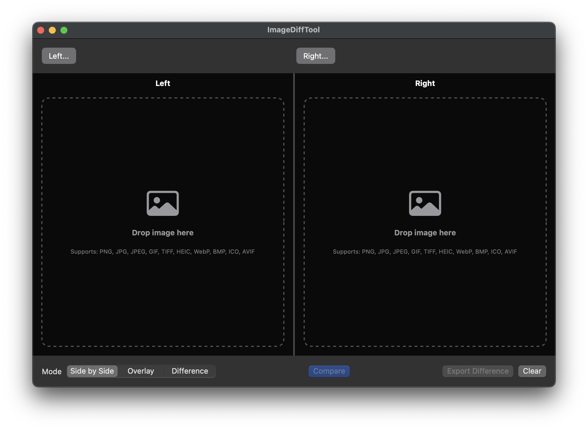

  

# Image Diff Tool

A simple and elegant macOS application for visually comparing images with drag-and-drop functionality.

## Features

- **Smart Drag & Drop**: Drop images into panels or drop 2 images simultaneously to auto-populate both sides
- **Comparison Modes**:
  - **Side by Side**: Manual comparison view
  - **Overlay**: Adjustable opacity blending with animated loop option
  - **Difference**: Visual highlighting of changed pixels
- **Wide Format Support**: PNG, JPG, GIF, TIFF, HEIC, WebP, BMP, ICO, AVIF
- **Export**: Save difference images as PNG files

## Requirements

- macOS 13.0 or later
- Xcode 15.0 or later (for building)

## Installation

### Build from Source
1. Clone the repository
2. Open `ImageDiffTool.xcodeproj` in Xcode
3. Select your development team and press Cmd+R to build and run

## Usage

1. **Load Images**: Drag image files into left/right panels
2. **Select Mode**: Choose Side by Side, Overlay, or Difference
3. **Compare**: Click "Compare" to process images
4. **Export**: Save difference images with "Export Difference"

## Technical Stack

- SwiftUI for UI development
- Core Image for image processing
- NSView for drag-and-drop functionality

## License

This project is provided as-is for educational and personal use.
